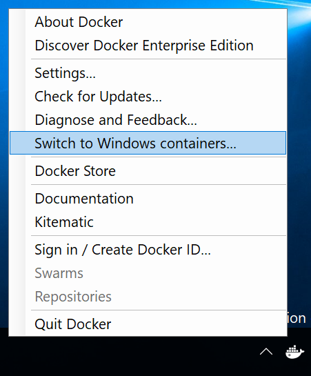

Installing Docker Community Edition
===================================

Mac
---

1. Visit [https://docs.docker.com/docker-for-mac/install/#what-to-know-before-you-install](https://docs.docker.com/docker-for-mac/install/#what-to-know-before-you-install) to ensure you have the requirements necessary.

2. Download [Docker Community Edition](https://store.docker.com/search?offering=community&type=edition) and install as you would any Mac app.

Windows
-------

1. Turn on virtualization in the bios.  Every bios is different, so you'll need to search for the specifics.

2. Install `Hyper-V` from Start -> Control Panel -> Programs and Features -> Turn Windows Features on or off.

3. From the same dialog, also turn on Containers.

4. Download [Docker Community Edition](https://store.docker.com/search?offering=community&type=edition) and install as you would any Windows app.

5. Gratuitous reboots.

Docker in a VMWare VM
---------------------

See [this post](https://communities.vmware.com/thread/498837) to get a VMware Workstation virtual machine to run Docker.  This assumes you've enabled visualization on the host's bios so you can run VMware.

Verify it Works
---------------

From a command prompt / terminal, type:

`docker --version`

then type

`docker run hello-world`

If both of these work as expected, you've succeeded!

Start downloading docker images
-------------------------------

Downloading docker images takes a while, so let's kick this off so we make sure they exist when we need them:

1. `docker pull ubuntu`
2. `docker pull nginx`
3. `docker pull node`
4. `docker pull microsoft/dotnet`

If you're on a Windows machine, switch to Windows Containers by right-clicking the Docker icon in the system tray and choose "Switch to Windows Containers", then download these additional containers:

1. `docker pull microsoft/nanoserver`
2. `docker pull stefanscherer/node-windows:7-nano`
3. Switch back to Linux containers -- we'll begin with Linux workloads

Help your neighbor
------------------

There's someone sitting next to you whose struggling with this.  Let's pair and help each other.  When that machine is running, let's all celebrate and join another team.  At the end, we'll celebrate around the last machine.
